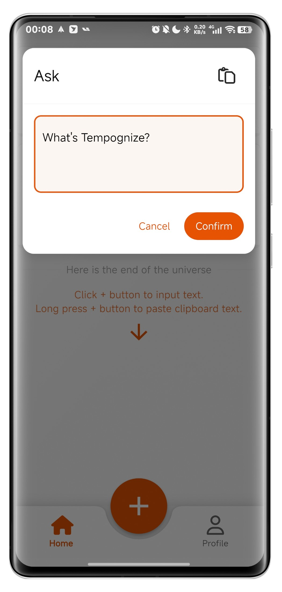
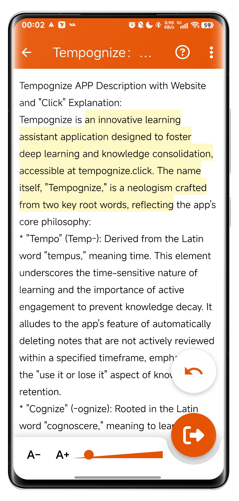
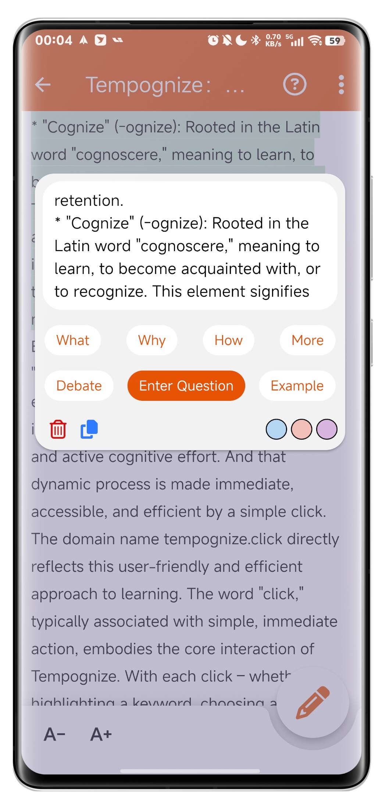
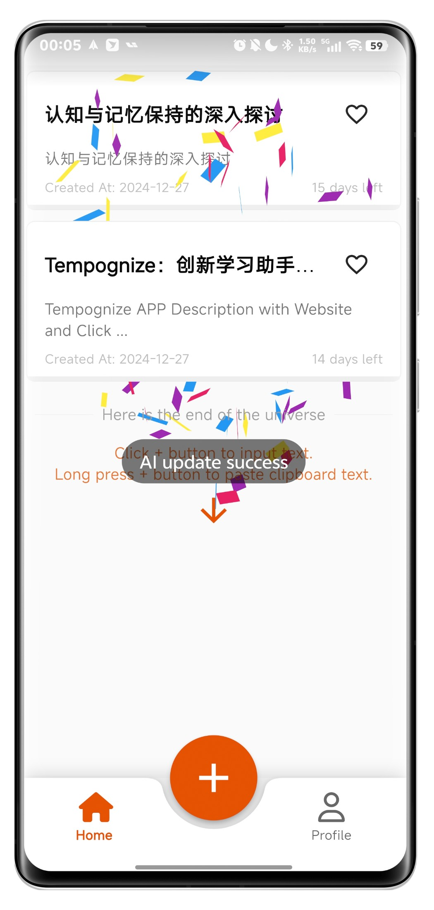

# Tempognize · 知时
### Innovative Learning Assistant Application
Tempognize is an innovative learning assistant application designed to foster deep learning and knowledge consolidation, accessible at tempognize.click. The name itself, "Tempognize," is a neologism crafted from two key root words, reflecting the app's core philosophy.

## 🎯 Core Features

- Empowers users with AI-driven Socratic question generation, fostering critical thinking and deep understanding.
- Innovative note lifecycle management system encourages active review and knowledge curation.
- Facilitates effective knowledge internalization through AI-powered periodic assessments.

## 📖 Introduction

Tempognize is an innovative learning assistant application designed to foster deep learning and knowledge consolidation, accessible at tempognize.click. The name itself, "Tempognize," is a neologism crafted from two key root words, reflecting the app's core philosophy:

- **"Tempo" (Temp-)**
  "Tempo" (Temp-) Derived from the Latin word "tempus," meaning time. This element underscores the time-sensitive nature of learning and the importance of active engagement to prevent knowledge decay.

- **"-cognize"**
  Rooted in the Latin word "cognoscere," meaning to learn, to become acquainted with, or to recognize. This element signifies the process of acquiring knowledge, understanding, and internalizing new information.
  
By combining these two root words, "Tempognize" conveys the message that effective learning is a dynamic process involving both time-sensitive engagement and active cognitive effort. And that dynamic process is made immediate, accessible, and efficient by a simple click.

## 📱 APP Screenshot

  
  
  
  

## 📥 Download

We will release the app on the App Store and Github Release.

## 🔗 Links

- [GitHub](https://github.com/atfa/Tempognize)

## 📄 Copyright

© 2024 Tempognize. All rights reserved.
